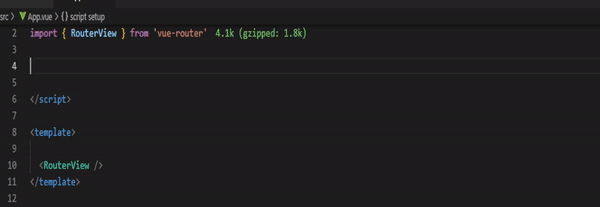

# vue-router-auto-complete

> 此套件基於 TypeScript 開發使用

這個套件讓你在使用 `vue-router` 時有語法提示，也可以幫你自動補齊 children routes 的前綴。

---

## 安裝
```
$ npm i vue-router-auto-complete
```

## 基本使用方式

```ts
import { generateRoutes } from 'vue-router-auto-complete'

const routes = {
  home: '/',
  dashboard: {
    index: '/dashboard',
    tabs: {
      tab1: '/tab1',
      tab2: '/tab2'
    }
  }
}

export default generateRoutes<typeof routes>(routes)
```

他會幫你生成下面的物件

```json
{
    "home": {
        "path": "/",
        "name": "home"
    },
    "dashboard": {
        "index": {
            "path": "/dashboard",
            "name": "dashboard.index"
        },
        "tabs": {
            "tab1": {
                "path": "/dashboard/tab1",
                "name": "dashboard.tabs.tab1"
            },
            "tab2": {
                "path": "/dashboard/tab2",
                "name": "dashboard.tabs.tab2"
            }
        }
    }
}
```

這時也會有完整的語法提示可以使用:



在 `router` 定義也可以方便許多
```ts
import routes from '@/const/routes'
import { createRouter, createWebHistory } from 'vue-router'
import HomeView from '../views/HomeView.vue'

const router = createRouter({
  history: createWebHistory(import.meta.env.BASE_URL),
  routes: [
    {
      ...routes.home,
      component: HomeView
    },
    {
      ...routes.dashboard.index,
      children: [
        {
          ...routes.dashboard.tabs.tab1,
          component: () => import('@/views/dashboard/tabs/Tab1View.vue')
        },
        {
          ...routes.dashboard.tabs.tab2,
          component: () => import('@/views/dashboard/tabs/Tab2View.vue')
        }
      ]
    }
  ]
})

export default router
```

`RouterLink` 的使用上也是
```html
<script setup lang="ts">
import { RouterLink, RouterView } from 'vue-router'
import routes from './const/routes'
</script>

<template>
  <RouterLink :to="routes.home.path">Home</RouterLink>
  <RouterLink :to="routes.dashboard.tabs.tab1.path">tab 1</RouterLink>
  <RouterLink :to="routes.dashboard.tabs.tab2.path">tab 2</RouterLink>
  <hr />
  <RouterView />
</template>
```

---

## 帶參數使用

與原來 vue-router 的定義方式相同

```ts
import { generateRoutes } from 'vue-router-auto-complete'

const routes = {
  home: '/',
  page: '/page/:page',
}

export default generateRoutes<typeof routes>(routes)
```

會生成
```json
{
    "home": {
        "path": "/",
        "name": "home"
    },
    "page": {
        "path": "/page/:page",
        "name": "page"
    }
}
```

RouterLink 範例
```html
<RouterLink :to="{ ...routes.page, params: { page: 'hello' } }">Hello Page</RouterLink>
```

會轉址到 `/page/hello`
